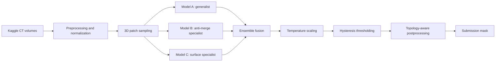

# Architecture

This repository is organized around a topology-aware 3D segmentation pipeline.

## Design principle

The pipeline treats topology errors as first-class failures. A small bridge or split can matter more than a small average Dice improvement, so the system combines:

- specialist models with different failure profiles
- validation metadata that decomposes proxy behavior
- thresholding designed to preserve confident connected regions
- runtime degradation levels for Kaggle notebook constraints

## Repository implementation

The heavy training and inference logic lives in Kaggle notebooks. The lightweight `src/vesuvius/` package extracts small, testable pieces:

- config validation
- metadata validation
- hysteresis-style connected component filtering

This makes the repository reviewable without requiring a GPU or the private competition data.
